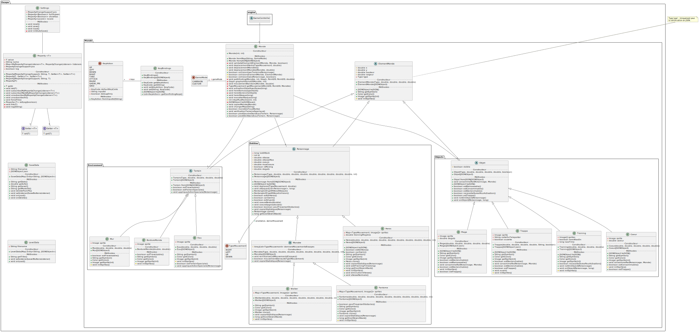

<div align="center">

# Escape

</div>

## Authors
* [Victor DALLÉ](https://github.com/victord54)
* [Claire KURTH](https://github.com/clairekth)
* [Dan DEMANGE](https://github.com/Hazvard)
* [Théo FAEDO](https://github.com/TheoFaedo)
* [Antoine CONTOUX](https://github.com/ActxLeToucan)

## Description
// TODO

## Project management
* [Trello](https://trello.com/b/WUfGrD7d/escape)

## Installation
> [!IMPORTANT]
> Copy the file [`.env.dist`](.env.dist) to `.env` and fill in the values.

### Requirements
* Maven >= 3.4.1
* Java >= 17

### Development
#### Run
```bash
mvn clean javafx:run
```

#### Test
```bash
mvn clean test
```

### Production
#### Build
```bash
mvn clean package
```

#### Run
> [!NOTE]
> Replace X.Y.Z with the version number, e.g. `1.0.0`.
##### GUI mode
```bash
java -jar target/escape-X.Y.Z.jar
```

##### CLI mode
```bash
java -jar target/escape-X.Y.Z.jar --nowindow
```

##### Debug
To see debug messages, add the `--debug` option.
```bash
java -jar target/escape-X.Y.Z.jar --debug [other options]
```

## Docs
### Sprints
* [Sprint 0](docs/sprints/0)
* [Sprint 1](docs/sprints/1)
* [Sprint 2](docs/sprints/2)

### Latest UML diagrams
* [Class diagram](docs/uml/class-diagram.svg)\

* [Other diagrams](docs/uml)
