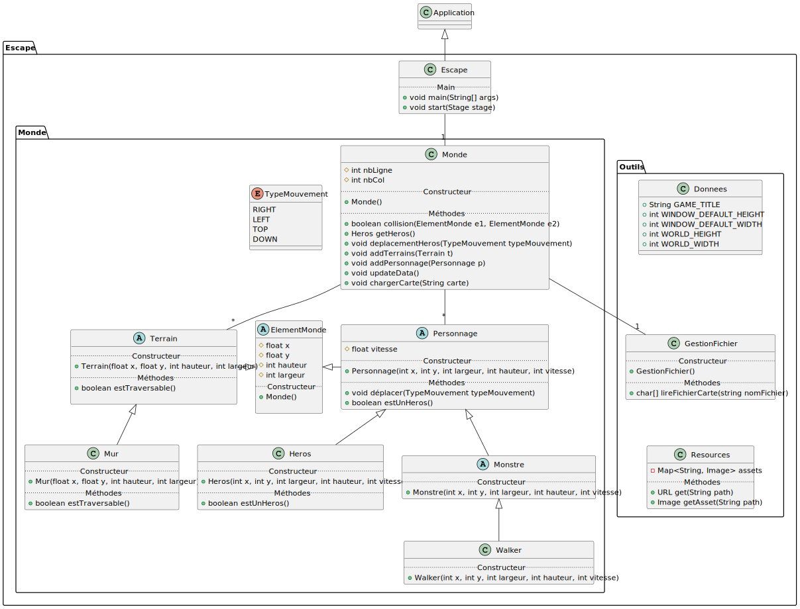

# Escape
## Authors
* [Victor DALLÉ](https://github.com/victord54)
* [Claire KURTH](https://github.com/clairekth)
* [Dan DEMANGE](https://github.com/Hazvard)
* [Théo FAEDO](https://github.com/TheoFaedo)
* [Antoine CONTOUX](https://github.com/ActxLeToucan)

## Description
// TODO

## Installation
### Requirements
* Maven >= 3.4.1
* Java >= 17

### Development
#### Run
```bash
mvn clean javafx:run
```

#### Test
```bash
mvn clean test
```

### Production
#### Build
```bash
mvn clean package
```

#### Run
```bash
java -jar target/escape-X.Y-Z.jar
```
> Replace X.Y-Z with the version number, e.g. `1.0-SNAPSHOT`.

## Docs
### Sprints
* [Sprint 0](docs/sprints/0)

### Latest UML diagrams
* [Class diagram](./docs/sprints/0/uml/class-diagram.svg)\

* [Other diagrams](./docs/sprints/0/uml)
